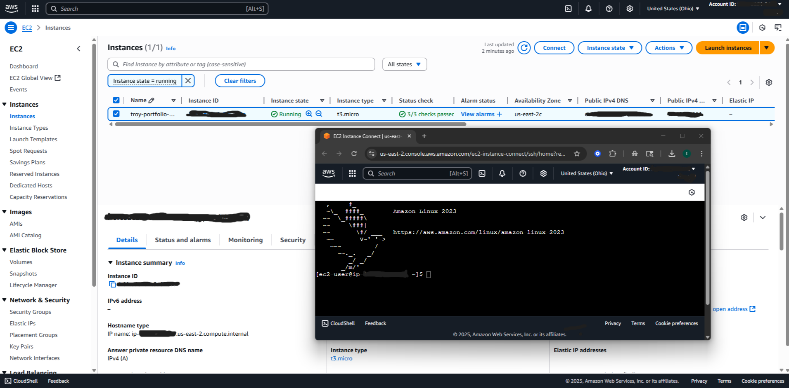

# Week 2 – IAM & EC2 Connectivity

## Objectives
- Learn basic IAM and EC2 connectivity
- Launch and connect to a virtual machine
- Visualize AWS resources with a diagram

---

## Steps Completed ✅

1. **IAM Setup**
   - Created IAM user with AdministratorAccess
   - Logged in with IAM user instead of root

2. **EC2 Instance Launch**
   - Instance type: `t3.micro`
   - AMI: Amazon Linux 2023
   - Security group: Allowed SSH (port 22) temporarily for testing
   - Key pair not used (connected with EC2 Instance Connect)

3. **Connecting to EC2**
   - Used **EC2 Instance Connect** in AWS console
   - Successfully logged in and confirmed with banner:

     ```
     Amazon Linux 2023
     https://aws.amazon.com/linux/amazon-linux-2023
     ```

4. **Architecture Diagram**
   - [View diagram](./Diagrams/ec2-diagram.png) (created in draw.io, exported as PNG)

---

## Screenshots


---


